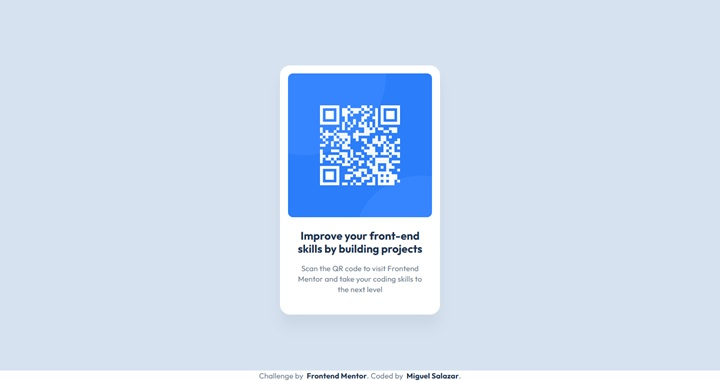

# Frontend Mentor - QR code component solution

This is my solution to the [QR code component challenge on Frontend Mentor](https://www.frontendmentor.io/challenges/qr-code-component-iux_sIO_H). The Frontend Mentor challenges its a great way to learn or improve our coding skills.

## Table of contents

- [Overview](#overview)
  - [Screenshot](#screenshot)
  - [Links](#links)
- [My process](#my-process)
  - [Built with](#built-with)
  - [What I learned](#what-i-learned)
  - [Continued development](#continued-development)
  - [Useful resources](#useful-resources)
- [Author](#author)

## Overview

### Screenshot



### Links

- Live Site URL: [You can view my solution live!](https://miguel-salazar-dev.github.io/qr-code-component-main/)

## My process

### Built with

- HTML
- CSS

### What I learned

This challenge was a very good recap to CSS knowledge, it took me to read and find out solutions to Flexboxes layouts. It was a very good challenge to beggin.

The more challenging thing for me to get a solution was getting the flexbox of the card to keep it size, because the text keep growing it. This was the part of the CSS that help me with that:

```css
.card {
  width: 320px;
  box-sizing: border-box;
  display: flex;
  flex-direction: column;
  justify-content: left;
  background-color: var(--white);
  row-gap: var(--spacing-300);
  padding: var(--spacing-200) var(--spacing-200) var(--spacing-500);
  border-radius: 20px;
  box-shadow: 0 25px 25px 0 rgba(0, 0, 0, 0.0477);
}

.text-container {
  display: flex;
  flex-direction: column;
  justify-content: center;
  flex-wrap: wrap;
  row-gap: var(--spacing-200);
  padding: 0 var(--spacing-200);
  text-align: center;
  overflow-wrap: break-word;
}
```

### Continued development

I want to learn a lot more about CSS and all the frontend!

### Useful resources

- [MDN Documentation](https://developer.mozilla.org/es/) - All about CSS, HTML and Javascript in one place, kind of technical sometimes but a great source of information.

## Author

- Website - [Miguel Salazar](https://github.com/Miguel-Salazar-Dev)
- Frontend Mentor - [@Miguel-Salazar-Dev](https://www.frontendmentor.io/profile/Miguel-Salazar-Dev)
